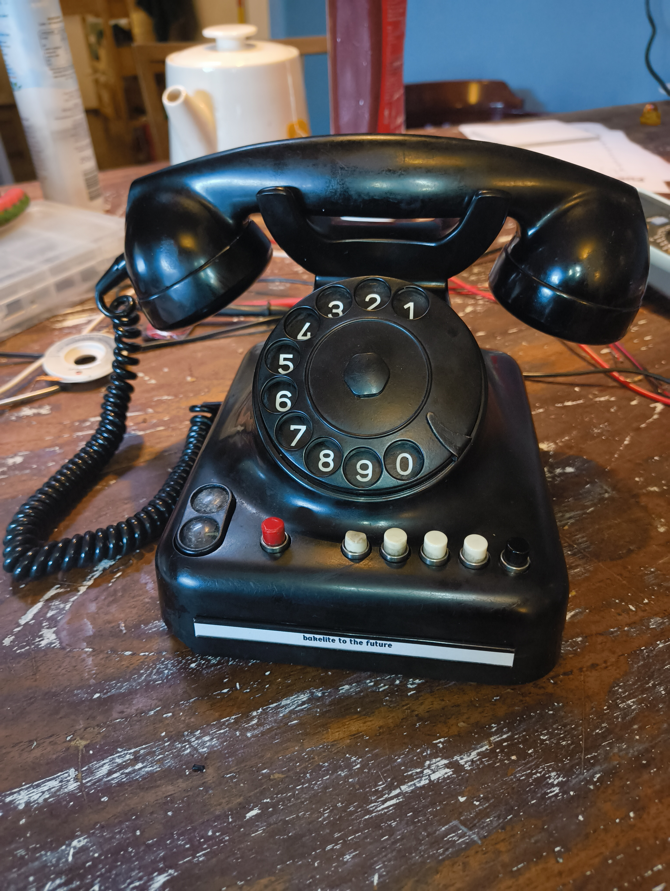

# Bakelite to the Future

A fully functioning bluetooth headset built into an old rotary bakelite phone.

This is a project based on [ESP IDFs Hands-Free Profile (HFP HF) example repository](https://github.com/espressif/esp-idf/blob/master/examples/bluetooth/bluedroid/classic_bt/hfp_hf/README.md).

For the story and more pictures check my [blog post](https://blog.waleson.com/2024/10/bakelite-to-future-1950s-rotary-phone.html)

Have fun hacking!
